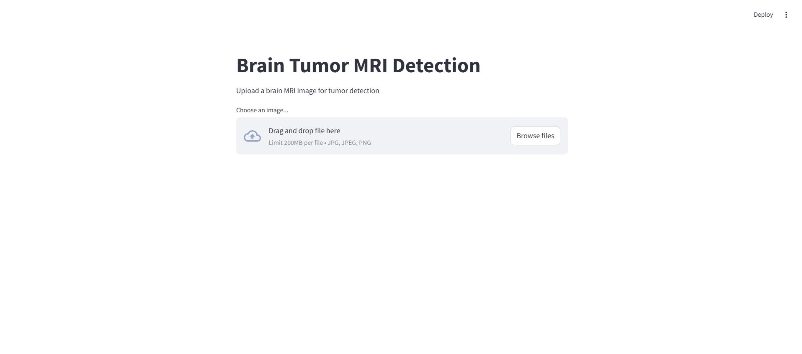

# Brain Tumor MRI Detection System 🧠



A deep learning-powered web application that detects and classifies brain tumors from MRI scans. Built with Streamlit, TensorFlow, and EfficientNetB1.

## 🎯 Features
- Real-time brain tumor detection
- Multiple tumor classification (Glioma, Meningioma, Pituitary, Normal)
- Interactive web interface
- Confidence score visualization

## 🛠️ Technologies Used
- Python 3.8+
- TensorFlow 2.x
- Streamlit
- OpenCV
- EfficientNetB1

## 📁 Project Structure
```
├── app.py                   # Streamlit application
├── brain_tumor_detection.ipynb  # Model training notebook
├── model.keras              # Trained model
├── requirements.txt         # Project dependencies
└── assets/                 # Images and resources
```

## ⚙️ Installation

1. Clone the repository:
```bash
git clone https://github.com/Manish-Kumar24/brain-tumor-mri-detection-streamlit.git
cd brain-tumor-mri-detection-streamlit
```

2. Install dependencies:
```bash
pip install -r requirements.txt
```

3. Train the model:
- Open `brain_tumor_detection.ipynb` in Jupyter Notebook
- Run all cells to train and save the model
- Ensure `model.keras` is saved in the project root directory

## 🚀 Usage
1. Start the Streamlit app:
```bash
streamlit run app.py
```

2. Open `http://localhost:8501`
3. Upload an MRI scan image
4. View detection results

## 📊 Model Training
The model uses the [Brain Tumor MRI Dataset](https://www.kaggle.com/datasets/masoudnickparvar/brain-tumor-mri-dataset) from Kaggle.

## 📝 License
MIT License

## 👥 Contributing
1. Fork the repository
2. Create a branch
3. Make changes
4. Submit a pull request

## 📧 Contact
Your Name - [manishkumar202209@gmail.com](mailto:manishkumar202209@gmail.com)

Project Link: [https://github.com/Manish-Kumar24/brain-tumor-mri-detection-streamlit](https://github.com/Manish-Kumar24/brain-tumor-mri-detection-streamlit)
